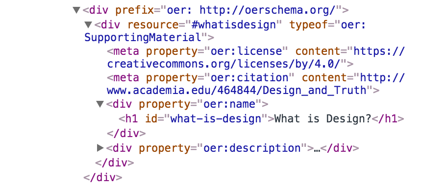

# License

This course will contain materials that are governed by a variety of licenses. Content spans public domain, Creative Commons, and Copyrighted materials used under Fair Use protection. Please be aware that a single license cannot apply to the entire course due to license incompatibilities. OER Schema, viewable in the HTML source code, makes reference licenses to make identification easier for software applications. This course has not completed production, and licences, citations, and references are still being applied to content. This file will be updated when this process is completed.

## Example usage in HTML

---

