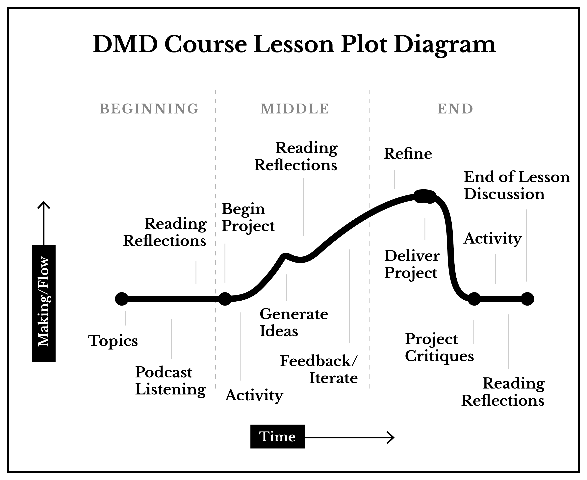

# Storytelling

We are surrounded by stories. These stories affect our attitudes, beliefs, and form our entire perception of reality. Historically, stories are how humans have transferred knowledge from generation to generation. These stories are how we make sense of the world and the people who tell the stories that are consumed the most ultimately have the greatest impact on society. Everything a designer does will be in support of telling stories and by extension, shape the world we inhabit.

> Storytelling has a long history as a mechanism of knowledge transfer and can be considered a rapid immersion in an experience: One cannot experience time travel, but one can gain knowledge about the act of time travel through a rich compelling, and highly experiential story.
>   
>   – Jon Kolko

Watch the host of This American Life, Ira Glass, talk about the power of storytelling: [Ira Glass on Storytelling](https://www.youtube.com/watch?v=K1NQKrbVslk) **(13:07)**

## Lesson Objective

The goal of this lesson is not to teach you every facet and application of storytelling. Mastering this subject, as with most subjects, will take quite a long time. Instead, you will learn about common elements of story-telling, structural models, and methods for building stories that you can apply as a framework for most of what you create and communicate as a designer.

In this lesson, you will complete the following: 

1. Read, watch, and listen to lesson topics and media
2. Reading assignment short reflections
3. Two Activities
4. Interactive story project
5. End-of-lesson course-wide discussion

# Citation

1. Kolko, Jon. Thoughts on Interaction Design: a collection of reflections / written and compiled by Jon Kolko. Second Edition. (2011) P.43 ISBN: 978-0-12-380930-8